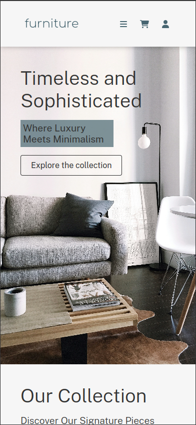

# Furniture Store Website

## Overview

This is a static frontend design for a furniture store, suitable for general e-commerce purposes. The website is built using HTML and CSS and is fully responsive across various screen sizes. The design includes pages for home, product overview, shopping cart, and individual product details.

## Features

- **Responsive Design**: Adapts to various screen sizes including 600px, 890px, 1200px, 1400px, and 1600px breakpoints.
- **Modern Layout**: Utilizes CSS Grid and Flexbox for layout and positioning.
- **Minimal Dependencies**: Only uses FontAwesome for icons and Google Fonts for typography.
- **Static Pages**: Includes static HTML pages for different sections of the site with a boilerplate for easy expansion.

## Project Structure

- `index.html`: Home page
- `collection.html`: Product overview page
- `shopping-cart.html`: Full site shopping cart page
- `products/*.html`: Individual product pages (dummy content included)
- `boilerplate.html`: HTML boilerplate with header and footer ready for main content and additional styling
- `css/`: Directory containing CSS files
- `assets/img`: Directory for image assets
- `screenshots/`: Directory for project screenshots

## Installation

1. **Clone the Repository:**:
   ```bash
   git clone https://github.com/yousifpa98/furtniture_store_frontend.git
   ```
2. **Navigate to the Project Directory:**
   ```bash
   cd furniture-store-website
   ```
3. **Open the `index.html` File:**
   - You can view the project by opening the index.html file in a web browser.

## Screenshots

Here are some screenshots of the project:


## Usage

The website is static and does not include JavaScript functionality. It is designed for display purposes and can be used as a template for building a more dynamic e-commerce site.

## Contact

For any questions or feedback, feel free to reach out to me:

- GitHub: [GitHub-Profile](https://www.github.com/yousifpa98)

## More Screenshots:




